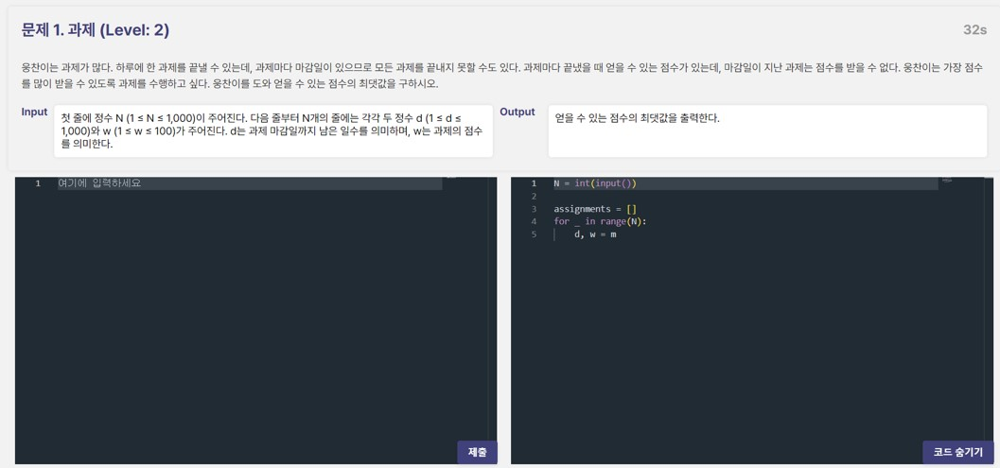
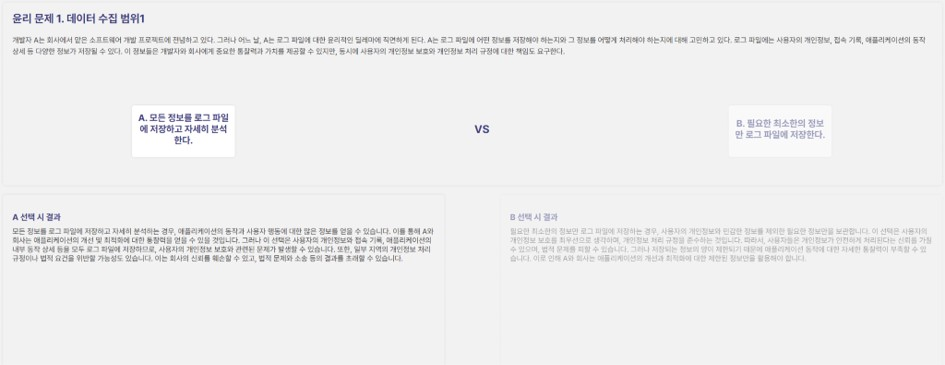

# FUNCODING
Have Fun Learning programming with games!
- Coding Battle with AI
- Coding Ethics Balance Game

## Examples
### Coding Battle Page

### Coding Ethics Balance Game Page

## Collaborators

|Name|                    GitHub ID                    |        Role        |
|:---:|:-----------------------------------------------:|:------------------:|
|오승재|     [dhtmdwo](https://github.com/dhtmdwo)     | Backend Developer  |
|서민석|         [Nebula622](https://github.com/Nebula622)         |      Backend Developer      |
|백일웅|        [1ilwoong100](https://github.com/1ilwoong100)        |  Backend Developer   |
|조명하|     [chomyungha51](https://github.com/chomyungha51)     | Frontend Developer  |
|조예성| [JYS1998](https://github.com/JYS1998) |   Frontend Developer   |
|강현서|    [hyunseo-k](https://github.com/hyunseo-k)    | Frontend Developer |

## License

Licensed under [MIT](https://opensource.org/licenses/MIT).
